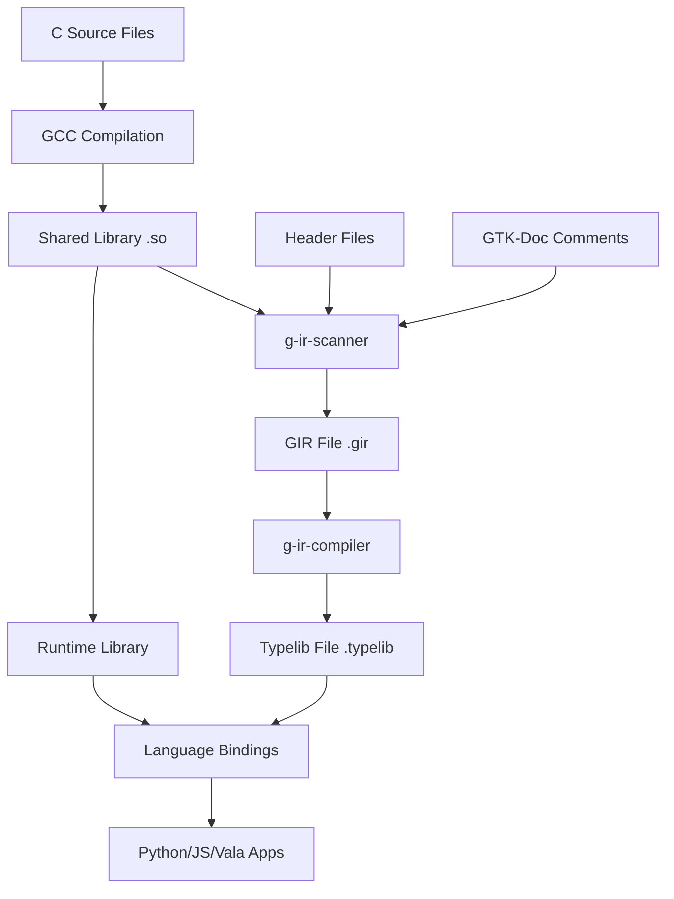

# Detailed Explanation: GObject with GObject Introspection Implementation

## Table of Contents

1. [Introduction and Architecture](#introduction-and-architecture)
2. [GObject Type System Deep Dive](#gobject-type-system-deep-dive)
3. [Implementation Breakdown](#implementation-breakdown)
4. [Introspection System Explained](#introspection-system-explained)
5. [Build Process and Toolchain](#build-process-and-toolchain)
6. [Language Bindings Mechanics](#language-bindings-mechanics)
7. [Memory Management and Reference Counting](#memory-management-and-reference-counting)
8. [Performance Considerations](#performance-considerations)
9. [Advanced Patterns and Techniques](#advanced-patterns-and-techniques)
10. [Real-World Applications](#real-world-applications)

---

## Introduction and Architecture

### What is GObject Introspection?

GObject Introspection (GI) is a middleware layer that sits between C libraries using GObject and higher-level language bindings. It solves the fundamental problem of how to automatically generate language bindings for C libraries without manual wrapper code.

### The Problem GI Solves

Before GObject Introspection, creating language bindings required:

1. **Manual wrapper writing** - Each function needed hand-written binding code
2. **Maintenance burden** - Every API change required updating all language bindings
3. **Type marshalling complexity** - Converting between C types and language-native types
4. **Memory management** - Handling reference counting across language boundaries
5. **API inconsistency** - Different bindings often had different APIs for the same functionality

### The GI Solution Architecture

```
┌─────────────────────────────────────────────────────────────────┐
│                    Language Ecosystem                           │
├─────────────────┬─────────────────┬─────────────────┬──────────┤
│ Python (PyGI)   │ JavaScript(GJS) │ Vala Compiler   │ Others   │
├─────────────────┴─────────────────┴─────────────────┴──────────┤
│              GObject Introspection Runtime                     │
├─────────────────────────────────────────────────────────────────┤
│                      Typelib Files                             │
│                  (Binary Metadata)                             │
├─────────────────────────────────────────────────────────────────┤
│                        GIR Files                               │
│                    (XML Metadata)                              │
├─────────────────────────────────────────────────────────────────┤
│                    C Library + GObject                         │
│                 (Runtime Type System)                          │
└─────────────────────────────────────────────────────────────────┘
```

---

## GObject Type System Deep Dive

### Foundation: GType System

The GObject type system is built on GType, which provides:

1. **Runtime Type Information (RTTI)** - Types are registered and queryable at runtime
2. **Dynamic Type Registration** - New types can be registered during program execution
3. **Inheritance Hierarchy** - Single inheritance with interface support
4. **Type Safety** - Runtime type checking with explicit casting

### Type Registration Process

```c
// This macro expands to register our type with the type system
G_DEFINE_TYPE_WITH_PRIVATE (MyObject, my_object, G_TYPE_OBJECT)

// Expands roughly to:
static void my_object_class_init (MyObjectClass *klass);
static void my_object_init (MyObject *self);
static gpointer my_object_parent_class = NULL;

GType
my_object_get_type (void)
{
  static volatile gsize g_define_type_id__volatile = 0;
  if (g_once_init_enter (&g_define_type_id__volatile)) {
    GType g_define_type_id =
      g_type_register_static_simple (G_TYPE_OBJECT,
                                    g_intern_static_string ("MyObject"),
                                    sizeof (MyObjectClass),
                                    (GClassInitFunc) my_object_class_init,
                                    sizeof (MyObject),
                                    (GInstanceInitFunc) my_object_init,
                                    (GTypeFlags) 0);
    
    // Add private data
    g_type_add_instance_private (g_define_type_id, sizeof (MyObjectPrivate));
    
    g_once_init_leave (&g_define_type_id__volatile, g_define_type_id);
  }
  return g_define_type_id__volatile;
}
```

### Class vs Instance Separation

**Class Structure** (`MyObjectClass`):
- Shared among all instances
- Contains virtual function pointers
- Initialized once per type
- Stores default values and callbacks

**Instance Structure** (`MyObject`):
- Unique per object instance
- Contains instance-specific data
- Initialized for each new object
- References the class structure

### The Private Data Pattern

```c
struct _MyObject {
    GObject parent_instance;      // Must be first - enables casting
    /*< private >*/
    MyObjectPrivate *priv;        // Opaque pointer to private data
};

struct _MyObjectPrivate {
    gint value;                   // Actual instance data
    gchar *name;                  // Hidden from public API
};
```

**Benefits of Private Data:**
- **ABI Stability** - Public structure never changes size
- **Encapsulation** - Private members cannot be accessed directly
- **Memory Efficiency** - Private data allocated in single block
- **Type Safety** - Private data strongly typed internally

---

## Implementation Breakdown

### Header File Analysis (`myobject.h`)

#### Type Macros

```c
#define MY_TYPE_OBJECT (my_object_get_type())
#define MY_OBJECT(obj) (G_TYPE_CHECK_INSTANCE_CAST((obj), MY_TYPE_OBJECT, MyObject))
```

These macros provide:
- **Type identification** - `MY_TYPE_OBJECT` returns the GType
- **Safe casting** - `MY_OBJECT()` performs runtime type checking
- **Type checking** - `MY_IS_OBJECT()` validates object type
- **Class access** - `MY_OBJECT_GET_CLASS()` retrieves class structure

#### Forward Declarations

```c
typedef struct _MyObject MyObject;
typedef struct _MyObjectClass MyObjectClass;
typedef struct _MyObjectPrivate MyObjectPrivate;
```

**Purpose:**
- Avoid circular header dependencies
- Allow pointers before full structure definition
- Enable mutual references between types
- Support incomplete type usage

#### Structure Design

```c
struct _MyObjectClass {
    GObjectClass parent_class;
    
    // Virtual methods for subclassing
    void (*value_changed) (MyObject *self, gint new_value);
    
    /*< private >*/
    gpointer padding[12];  // ABI stability padding
};
```

**Class Structure Elements:**
- **Parent class** - Must be first for inheritance
- **Virtual methods** - Function pointers for polymorphism
- **Padding** - Reserved space for future methods without breaking ABI

### Implementation File Analysis (`myobject.c`)

#### Property System Implementation

```c
enum {
    PROP_0,        // Always 0, never used
    PROP_VALUE,    // Our integer property
    PROP_NAME,     // Our string property
    N_PROPERTIES   // Count of properties
};

static GParamSpec *properties[N_PROPERTIES] = { NULL };
```

**Property Registration:**
```c
properties[PROP_VALUE] = 
    g_param_spec_int ("value",           // Property name
                     "Value",            // Nick (short description)
                     "The integer value",// Blurb (long description)
                     G_MININT,          // Minimum value
                     G_MAXINT,          // Maximum value
                     0,                 // Default value
                     G_PARAM_READWRITE | G_PARAM_EXPLICIT_NOTIFY);
```

**Property Flags Explained:**
- `G_PARAM_READABLE` - Property can be read
- `G_PARAM_WRITABLE` - Property can be written
- `G_PARAM_READWRITE` - Shorthand for both
- `G_PARAM_EXPLICIT_NOTIFY` - Only emit notify when explicitly called
- `G_PARAM_CONSTRUCT` - Set during object construction
- `G_PARAM_CONSTRUCT_ONLY` - Can only be set during construction

#### Signal System Implementation

```c
signals[VALUE_CHANGED] = 
    g_signal_new ("value-changed",                    // Signal name
                 G_TYPE_FROM_CLASS (klass),           // Object type
                 G_SIGNAL_RUN_LAST,                   // Signal flags
                 G_STRUCT_OFFSET (MyObjectClass, value_changed), // Class method
                 NULL, NULL,                          // Accumulator
                 g_cclosure_marshal_VOID__INT,        // Marshaller
                 G_TYPE_NONE,                         // Return type
                 1,                                   // Number of parameters
                 G_TYPE_INT);                         // Parameter types
```

**Signal Flags:**
- `G_SIGNAL_RUN_FIRST` - Call class method first
- `G_SIGNAL_RUN_LAST` - Call class method last
- `G_SIGNAL_RUN_CLEANUP` - Call class method during cleanup
- `G_SIGNAL_DETAILED` - Support detailed signal names

#### Memory Management Implementation

```c
static void
my_object_dispose (GObject *object)
{
    MyObject *self = MY_OBJECT (object);
    
    // Release references to other objects
    // Called potentially multiple times
    g_clear_object (&self->priv->some_object_ref);
    
    // Chain up to parent dispose
    G_OBJECT_CLASS (my_object_parent_class)->dispose (object);
}

static void
my_object_finalize (GObject *object)
{
    MyObject *self = MY_OBJECT (object);
    
    // Free allocated memory
    // Called exactly once
    g_free (self->priv->name);
    
    // Chain up to parent finalize
    G_OBJECT_CLASS (my_object_parent_class)->finalize (object);
}
```

**Dispose vs Finalize:**
- **Dispose** - Release references to other objects, may be called multiple times
- **Finalize** - Free memory and resources, called exactly once
- **Order** - Dispose runs first, then finalize
- **Chaining** - Always chain up to parent methods

---

## Introspection System Explained

### Documentation and Annotations

#### GTK-Doc Format

```c
/**
 * SECTION:myobject
 * @short_description: Example GObject with introspection
 * @title: MyObject
 * @stability: Stable
 * @include: myobject.h
 *
 * MyObject demonstrates proper GObject implementation with
 * full GObject Introspection support.
 */
```

#### Function Annotations

```c
/**
 * my_object_new_with_value:
 * @initial_value: the initial value to set
 *
 * Creates a new #MyObject with the specified initial value.
 *
 * Returns: (transfer full): a new #MyObject
 */
```

**Common Annotations:**

| Annotation | Meaning |
|------------|---------|
| `(transfer full)` | Caller owns the returned reference |
| `(transfer none)` | Caller doesn't own the returned reference |
| `(transfer container)` | Caller owns container but not contents |
| `(nullable)` | Parameter/return can be NULL |
| `(not nullable)` | Parameter/return cannot be NULL |
| `(array)` | Parameter is an array |
| `(array length=n)` | Array with length parameter |
| `(element-type Type)` | Container element type |
| `(in)` | Input parameter |
| `(out)` | Output parameter |
| `(inout)` | Input/output parameter |
| `(scope call)` | Callback valid during function call |
| `(scope async)` | Callback stored and called later |
| `(closure user_data)` | User data for callback |
| `(skip)` | Skip this function in bindings |

### GIR File Generation Process

#### g-ir-scanner Analysis

The scanner performs several passes:

1. **Preprocessing** - Runs C preprocessor to expand macros
2. **AST Building** - Parses C code into abstract syntax tree
3. **Symbol Resolution** - Matches functions to GObject types
4. **Annotation Processing** - Parses GTK-Doc comments
5. **Type Inference** - Determines types from function signatures
6. **XML Generation** - Outputs structured metadata

#### GIR File Structure

```xml
<repository version="1.2" xmlns="...">
  <include name="GObject" version="2.0"/>
  <package name="glib-2.0"/>
  <c:include name="myobject.h"/>
  
  <namespace name="My" version="1.0" 
             shared-library="libmyobject.so.1.0">
    
    <class name="Object" 
           c:symbol-prefix="my_object" 
           c:type="MyObject"
           parent="GObject.Object"
           glib:type-name="MyObject"
           glib:get-type="my_object_get_type">
      
      <property name="value" writable="1" readable="1">
        <type name="gint" c:type="gint"/>
      </property>
      
      <glib:signal name="value-changed">
        <return-value transfer-ownership="none">
          <type name="none" c:type="void"/>
        </return-value>
        <parameters>
          <parameter name="new_value" transfer-ownership="none">
            <type name="gint" c:type="gint"/>
          </parameter>
        </parameters>
      </glib:signal>
      
      <constructor name="new" c:identifier="my_object_new">
        <return-value transfer-ownership="full">
          <type name="My.Object" c:type="MyObject*"/>
        </return-value>
      </constructor>
      
    </class>
    
  </namespace>
</repository>
```

### Typelib Compilation

The GIR compiler (`g-ir-compiler`) converts XML to binary:

1. **Parsing** - Reads and validates GIR XML
2. **Optimization** - Removes redundant information
3. **Binary Encoding** - Converts to compact binary format
4. **Cross-References** - Resolves dependencies to other typelibs
5. **Output** - Generates `.typelib` file

**Typelib Benefits:**
- **Performance** - Binary format loads faster than XML
- **Size** - Compact representation saves memory
- **Runtime** - Optimized for introspection queries
- **Caching** - Can be memory-mapped for efficiency

---

## Build Process and Toolchain

### Complete Build Pipeline



### Makefile Deep Dive

#### Compiler Configuration

```makefile
CC = gcc
CFLAGS = -Wall -Wextra -std=c99 -fPIC
DEBUG_FLAGS = -g -O0 -DDEBUG
RELEASE_FLAGS = -O2 -DNDEBUG

# pkg-config integration
GLIB_CFLAGS = $(shell pkg-config --cflags glib-2.0 gobject-2.0)
GLIB_LIBS = $(shell pkg-config --libs glib-2.0 gobject-2.0)
```

**Flags Explained:**
- `-fPIC` - Position Independent Code (required for shared libraries)
- `-Wall -Wextra` - Enable comprehensive warnings
- `-std=c99` - Use C99 standard
- `-g` - Include debug symbols
- `-O0/-O2` - Optimization levels

#### GIR Generation Command

```makefile
$(GI_SCANNER) \
    --warn-all \                      # Enable all warnings
    --namespace=$(NAMESPACE) \        # Set namespace (My)
    --nsversion=$(NSVERSION) \        # Set version (1.0)
    --identifier-prefix=My \          # C identifier prefix
    --symbol-prefix=my \              # C symbol prefix
    --include=GObject-2.0 \           # Include parent namespace
    --library=$(LIBRARY_NAME) \       # Library to scan
    --library-path=$(LIBDIR) \        # Library search path
    --output=$@ \                     # Output file
    --pkg=glib-2.0 \                  # pkg-config package
    --pkg=gobject-2.0 \               # pkg-config package
    --c-include="myobject.h" \        # Header to include in GIR
    $(GLIB_CFLAGS) \                  # Compiler flags
    $(HEADERS) \                      # Header files to scan
    $(SOURCES)                        # Source files to scan
```

#### Installation Process

```makefile
install: release typelib
    sudo cp $(SHARED_LIB) /usr/local/lib/
    sudo cp $(HEADERS) /usr/local/include/
    sudo cp $(GIR_FILE) /usr/share/gir-1.0/
    sudo cp $(TYPELIB_FILE) /usr/lib/girepository-1.0/
    sudo ldconfig
```

**Installation Locations:**
- Libraries: `/usr/local/lib/` or `/usr/lib/`
- Headers: `/usr/local/include/` or `/usr/include/`
- GIR files: `/usr/share/gir-1.0/`
- Typelibs: `/usr/lib/girepository-1.0/`

### Dependency Management

#### Build Dependencies

```bash
# Ubuntu/Debian
sudo apt-get install \
    build-essential \
    libglib2.0-dev \
    gobject-introspection \
    libgirepository1.0-dev

# Fedora/RHEL
sudo dnf install \
    gcc \
    glib2-devel \
    gobject-introspection-devel

# Arch Linux
sudo pacman -S \
    base-devel \
    glib2 \
    gobject-introspection
```

#### Runtime Dependencies

```bash
# Core GObject system
glib2
gobject-introspection

# Language-specific runtimes
python3-gi          # Python bindings
gjs                 # JavaScript bindings
vala                # Vala compiler
```

---

## Language Bindings Mechanics

### Python Integration (PyGI)

#### Import Process

```python
import gi
gi.require_version('My', '1.0')  # Load specific version
from gi.repository import My     # Import namespace
```

**What happens internally:**
1. PyGI searches for `My-1.0.typelib` in `GI_TYPELIB_PATH`
2. Typelib is memory-mapped for efficiency
3. Python classes are dynamically generated
4. Method calls are wrapped with type conversion
5. Memory management hooks are installed

#### Type Marshalling

```python
# Python -> C
obj.set_value(42)
# Converts Python int to C gint

# C -> Python  
value = obj.get_value()
# Converts C gint to Python int

# String handling
obj.set_name("Hello")  # Python str -> C gchar*
name = obj.get_name()  # C gchar* -> Python str (no copy needed)
```

#### Property Access

```python
# Direct property access
obj.props.value = 100
print(obj.props.value)

# GObject-style access
obj.set_property("value", 100)
value = obj.get_property("value")

# Python-style access (if enabled)
obj.value = 100
print(obj.value)
```

#### Signal Connection

```python
def callback(obj, new_value):
    print(f"Value changed to {new_value}")

# Connect signal
obj.connect("value-changed", callback)

# Disconnect signal
obj.disconnect(signal_id)
```

### JavaScript Integration (GJS)

#### Module Loading

```javascript
imports.gi.versions.My = '1.0';  // Set version before import
const { My } = imports.gi;       // Import namespace
```

#### Object Creation

```javascript
// Constructor with properties
let obj = new My.Object({
    value: 42,
    name: "JavaScript Object"
});

// Factory method
let obj2 = My.Object.new_with_value(42);
```

#### Method Calls

```javascript
// Direct method calls
obj.increment();
let str = obj.to_string();

// Property access
obj.value = 100;
console.log(obj.value);
```

#### Signal Handling

```javascript
// Connect signal
obj.connect('value-changed', (obj, newValue) => {
    print(`Value changed to: ${newValue}`);
});

// One-time connection
obj.connect_after('value-changed', callback);
```

### Vala Integration

#### Compilation Process

```vala
// Vala source
using My;

int main() {
    var obj = new My.Object.with_value(42);
    obj.value_changed.connect((new_value) => {
        stdout.printf("Value: %d\n", new_value);
    });
    return 0;
}
```

**Compilation steps:**
1. Vala compiler reads `.vapi` binding file
2. Generates C code with proper GObject calls
3. C compiler links against the actual library
4. Result is native binary with no runtime overhead

#### VAPI Generation

```bash
# Generate Vala bindings from GIR
vapigen --library=My-1.0 \
        --pkg=glib-2.0 \
        --pkg=gobject-2.0 \
        --directory=. \
        My-1.0.gir
```

---

## Memory Management and Reference Counting

### GObject Reference Counting

#### Reference Semantics

```c
// Create object (ref count = 1)
MyObject *obj = my_object_new();

// Add reference (ref count = 2)  
g_object_ref(obj);

// Remove reference (ref count = 1)
g_object_unref(obj);

// Remove final reference (ref count = 0, object destroyed)
g_object_unref(obj);
```

#### Transfer Annotations

```c
// (transfer full) - caller owns the reference
MyObject *my_object_new(void);
// Caller must call g_object_unref()

// (transfer none) - caller doesn't own the reference  
const gchar *my_object_get_name(MyObject *self);
// Caller must not free the returned string

// (transfer container) - own container, not contents
GPtrArray *my_object_get_children(MyObject *self);
// Caller owns the array, but not the objects inside
```

### Language-Specific Memory Management

#### Python Memory Management

```python
# Python uses garbage collection
obj = My.Object.new()  # Creates Python wrapper + GObject
# When Python object is GC'd, GObject reference is released

# Manual reference management (rarely needed)
obj.ref()    # Add reference
obj.unref()  # Remove reference
```

#### JavaScript Memory Management

```javascript
// JavaScript also uses garbage collection
let obj = new My.Object();  // Creates JS wrapper + GObject

// Manual cleanup (automatic in most cases)
obj = null;  // Allows GC to clean up both JS and GObject
```

#### Weak References

```c
// Weak reference doesn't affect reference count
static void weak_notify(gpointer data, GObject *where_the_object_was)
{
    g_print("Object %p was finalized\n", where_the_object_was);
}

g_object_weak_ref(G_OBJECT(obj), weak_notify, NULL);
```

### Memory Debugging

#### Valgrind Integration

```bash
# Check for memory leaks
valgrind --leak-check=full \
         --show-leak-kinds=all \
         --track-origins=yes \
         ./your_program

# GObject-specific debugging
G_DEBUG=gc-friendly G_SLICE=always-malloc \
valgrind --leak-check=full ./your_program
```

#### Reference Count Debugging

```c
// Enable GObject debugging
export G_DEBUG=objects
export G_DEBUG=signals

// Your program output will show:
// GLib-GObject-DEBUG: object 0x1234 of type MyObject ref_count=1
```

---

## Performance Considerations

### Runtime Performance

#### Call Overhead

```c
// Direct C call (fastest)
my_object_set_value(obj, 42);

// Python binding call (adds overhead)
obj.set_value(42)  # Type conversion + function lookup

// Property access (additional overhead) 
obj.props.value = 42  # Property system + type conversion
```

**Performance hierarchy (fastest to slowest):**
1. Direct C function calls
2. JavaScript (GJS) - compiled to bytecode
3. Python direct method calls
4. Python property access
5. Vala (compiles to C, so native speed)

#### Memory Overhead

```c
// C object: sizeof(MyObject) + sizeof(MyObjectPrivate)
// Python wrapper: C object + Python PyObject + type info
// JavaScript wrapper: C object + JS object + V8 overhead
```

#### Optimization Strategies

1. **Batch Operations** - Group multiple calls together
2. **Avoid Property Access** - Use getters/setters for performance-critical code
3. **Cache Results** - Store frequently accessed values
4. **Use Native Types** - Prefer C types over complex objects in APIs

### Build-Time Performance

#### Parallel Compilation

```makefile
# Enable parallel builds
MAKEFLAGS += -j$(shell nproc)

# Parallel g-ir-scanner (when scanning multiple files)
$(GI_SCANNER) --jobs=$(shell nproc) ...
```

#### Incremental Builds

```makefile
# Proper dependency tracking
$(BUILDDIR)/%.o: %.c $(HEADERS)
	$(CC) $(CFLAGS) -MMD -c $< -o $@

# Include dependency files
-include $(OBJECTS:.o=.d)
```

#### Caching Strategies

```bash
# Use ccache for compilation caching
export CC="ccache gcc"

# Cache pkg-config results
GLIB_CFLAGS := $(shell pkg-config --cflags glib-2.0 gobject-2.0)
```

---

## Advanced Patterns and Techniques

### Interface Implementation

#### Defining Interfaces

```c
// Define interface
#define MY_TYPE_DRAWABLE (my_drawable_get_type())
G_DECLARE_INTERFACE(MyDrawable, my_drawable, MY, DRAWABLE, GObject)

struct _MyDrawableInterface {
    GTypeInterface parent_iface;
    
    // Virtual methods
    void (*draw)(MyDrawable *self, cairo_t *cr);
    gboolean (*can_draw)(MyDrawable *self);
};

G_DEFINE_INTERFACE(MyDrawable, my_drawable, G_TYPE_OBJECT)
```

#### Implementing Interfaces

```c
// Implement interface in your object
static void my_object_drawable_init(MyDrawableInterface *iface);

G_DEFINE_TYPE_WITH_CODE(MyObject, my_object, G_TYPE_OBJECT,
                        G_IMPLEMENT_INTERFACE(MY_TYPE_DRAWABLE,
                                            my_object_drawable_init))

static void
my_object_drawable_init(MyDrawableInterface *iface)
{
    iface->draw = my_object_draw_impl;
    iface->can_draw = my_object_can_draw_impl;
}
```

### Boxed Types

#### Custom Structures

```c
typedef struct {
    gchar *name;
    gint age;
    gdouble height;
} MyPersonData;

// Define copy and free functions
static MyPersonData *
my_person_data_copy(MyPersonData *data)
{
    MyPersonData *copy = g_slice_new(MyPersonData);
    copy->name = g_strdup(data->name);
    copy->age = data->age;
    copy->height = data->height;
    return copy;
}

static void
my_person_data_free(MyPersonData *data)
{
    g_free(data->name);
    g_slice_free(MyPersonData, data);
}

// Register boxed type
G_DEFINE_BOXED_TYPE(MyPersonData, my_person_data,
                    my_person_data_copy, my_person_data_free)
```

### Async Operations

#### GTask Integration

```c
// Async method signature
void my_object_compute_async(MyObject *self,
                           GCancellable *cancellable,
                           GAsyncReadyCallback callback,
                           gpointer user_data);

// Finish method signature  
gint my_object_compute_finish(MyObject *self,
                            GAsyncResult *result,
                            GError **error);

// Implementation
static void
compute_in_thread(GTask *task,
                 gpointer source_object,
                 gpointer task_data,
                 GCancellable *cancellable)
{
    MyObject *self = MY_OBJECT(source_object);
    gint result = 0;
    
    // Perform computation
    for (int i = 0; i < 1000000; i++) {
        if (g_cancellable_is_cancelled(cancellable)) {
            g_task_return_error(task, 
                g_error_new(G_IO_ERROR, G_IO_ERROR_CANCELLED, 
                           "Operation was cancelled"));
            return;
        }
        result += i;
    }
    
    g_task_return_int(task, result);
}

void
my_object_compute_async(MyObject *self,
                       GCancellable *cancellable,
                       GAsyncReadyCallback callback,
                       gpointer user_data)
{
    GTask *task = g_task_new(self, cancellable, callback, user_data);
    g_task_run_in_thread(task, compute_in_thread);
    g_object_unref(task);
}
```

### Plugin Systems

#### Loadable Modules

```c
// Plugin interface
#define MY_TYPE_PLUGIN (my_plugin_get_type())
G_DECLARE_INTERFACE(MyPlugin, my_plugin, MY, PLUGIN, GObject)

// Plugin implementation
typedef struct {
    GObject parent_instance;
} MyExamplePlugin;

G_DEFINE_TYPE_WITH_CODE(MyExamplePlugin, my_example_plugin, G_TYPE_OBJECT,
                        G_IMPLEMENT_INTERFACE(MY_TYPE_PLUGIN,
                                            my_example_plugin_init))

// Plugin loading
GType
my_plugin_get_type_from_module(const gchar *path)
{
    GModule *module = g_module_open(path, G_MODULE_BIND_LAZY);
    // Load and register types from module
}
```

---

## Real-World Applications

### GTK+ Integration

#### Custom Widgets

```c
// Custom GTK widget with introspection
#define MY_TYPE_CUSTOM_BUTTON (my_custom_button_get_type())
G_DECLARE_FINAL_TYPE(MyCustomButton, my_custom_button, MY, CUSTOM_BUTTON, GtkButton)

struct _MyCustomButton {
    GtkButton parent_instance;
    /*< private >*/
    MyCustomButtonPrivate *priv;
};

G_DEFINE_TYPE_WITH_PRIVATE(MyCustomButton, my_custom_button, GTK_TYPE_BUTTON)
```

#### Glade Integration

```xml
<!-- Glade UI file -->
<interface>
  <requires lib="gtk+" version="3.20"/>
  <object class="MyCustomButton" id="custom_button1">
    <property name="label">Custom Button</property>
    <property name="my-custom-property">42</property>
  </object>
</interface>
```

### GStreamer Plugins

#### Media Processing

```c
// GStreamer element with introspection
#define MY_TYPE_AUDIO_FILTER (my_audio_filter_get_type())
G_DECLARE_FINAL_TYPE(MyAudioFilter, my_audio_filter, MY, AUDIO_FILTER, GstAudioFilter)

struct _MyAudioFilter {
    GstAudioFilter parent;
    /*< private >*/
    MyAudioFilterPrivate *priv;
};

// Plugin registration function
static gboolean
plugin_init(GstPlugin *plugin)
{
    return gst_element_register(plugin, "myaudiofilter",
                              GST_RANK_NONE, MY_TYPE_AUDIO_FILTER);
}

GST_PLUGIN_DEFINE(
    GST_VERSION_MAJOR,
    GST_VERSION_MINOR,
    myaudioplugin,
    "My custom audio processing plugin",
    plugin_init,
    "1.0.0",
    "LGPL",
    "MyAudioPlugin",
    "http://example.com"
);
```

### Database Integration (SQLite + GObject)

#### ORM-like Pattern

```c
// Database-backed GObject
typedef struct {
    GObject parent_instance;
    /*< private >*/
    MyUserPrivate *priv;
} MyUser;

// Automatic loading from database
MyUser *
my_user_load_by_id(gint id, GError **error)
{
    sqlite3_stmt *stmt;
    sqlite3_prepare_v2(db, "SELECT * FROM users WHERE id = ?", -1, &stmt, NULL);
    sqlite3_bind_int(stmt, 1, id);
    
    if (sqlite3_step(stmt) == SQLITE_ROW) {
        MyUser *user = g_object_new(MY_TYPE_USER,
                                   "id", sqlite3_column_int(stmt, 0),
                                   "name", sqlite3_column_text(stmt, 1),
                                   "email", sqlite3_column_text(stmt, 2),
                                   NULL);
        sqlite3_finalize(stmt);
        return user;
    }
    
    sqlite3_finalize(stmt);
    g_set_error(error, MY_USER_ERROR, MY_USER_ERROR_NOT_FOUND,
                "User with id %d not found", id);
    return NULL;
}

// Automatic saving on property changes
static void
my_user_set_property(GObject *object, guint prop_id, 
                     const GValue *value, GParamSpec *pspec)
{
    MyUser *self = MY_USER(object);
    
    // Set property value
    switch (prop_id) {
        case PROP_NAME:
            g_free(self->priv->name);
            self->priv->name = g_value_dup_string(value);
            break;
        // ... other properties
    }
    
    // Auto-save to database
    if (self->priv->auto_save && self->priv->id > 0) {
        my_user_save(self, NULL);
    }
    
    g_object_notify_by_pspec(object, pspec);
}
```

### Web Service Integration

#### REST API Client

```c
// HTTP client with introspection support
typedef struct {
    GObject parent_instance;
    /*< private >*/
    MyApiClientPrivate *priv;
} MyApiClient;

// Async HTTP request
void
my_api_client_get_user_async(MyApiClient *self,
                             gint user_id,
                             GCancellable *cancellable,
                             GAsyncReadyCallback callback,
                             gpointer user_data)
{
    GTask *task = g_task_new(self, cancellable, callback, user_data);
    
    // Build URL
    gchar *url = g_strdup_printf("%s/users/%d", 
                                self->priv->base_url, user_id);
    
    // Create libsoup session and message
    SoupSession *session = soup_session_new();
    SoupMessage *message = soup_message_new("GET", url);
    
    // Send async
    soup_session_send_async(session, message, G_PRIORITY_DEFAULT,
                          cancellable, api_request_completed, task);
    
    g_free(url);
    g_object_unref(message);
    g_object_unref(session);
}

MyUser *
my_api_client_get_user_finish(MyApiClient *self,
                              GAsyncResult *result,
                              GError **error)
{
    return g_task_propagate_pointer(G_TASK(result), error);
}
```

### Configuration Management

#### GSettings Integration

```c
// Settings-backed properties
typedef struct {
    GObject parent_instance;
    /*< private >*/
    MyConfigPrivate *priv;
} MyConfig;

struct _MyConfigPrivate {
    GSettings *settings;
    gchar *server_url;
    gint port;
    gboolean auto_connect;
};

static void
my_config_init(MyConfig *self)
{
    self->priv = my_config_get_instance_private(self);
    
    // Connect to GSettings
    self->priv->settings = g_settings_new("com.example.myapp");
    
    // Bind properties to settings
    g_settings_bind(self->priv->settings, "server-url",
                   self, "server-url", G_SETTINGS_BIND_DEFAULT);
    g_settings_bind(self->priv->settings, "port",
                   self, "port", G_SETTINGS_BIND_DEFAULT);
    g_settings_bind(self->priv->settings, "auto-connect",
                   self, "auto-connect", G_SETTINGS_BIND_DEFAULT);
}
```

---

## Debugging and Troubleshooting

### Common Issues and Solutions

#### 1. Symbol Resolution Errors

**Problem:**
```
GI symbol not found: my_object_new
```

**Solution:**
```bash
# Check if symbol is exported
nm -D libmyobject.so | grep my_object_new

# Verify library loading
ldd your_program

# Check GIR file contains the symbol
grep -n "my_object_new" build/gir/My-1.0.gir
```

#### 2. Type Registration Issues

**Problem:**
```
GLib-GObject-CRITICAL: g_object_new_with_properties: assertion 'G_TYPE_IS_OBJECT (object_type)' failed
```

**Solution:**
```c
// Ensure get_type() function is called before use
GType type = my_object_get_type();
g_assert(G_TYPE_IS_OBJECT(type));

// Or use G_TYPE_CHECK macros
g_assert(MY_IS_OBJECT(obj));
```

#### 3. Memory Leaks in Language Bindings

**Problem:**
```
Memory leak detected in Python/JS code
```

**Solution:**
```python
# Python: Ensure proper cleanup
try:
    obj = My.Object.new()
    # Use object
finally:
    obj = None  # Allow GC
    
# Or use context managers
class GObjectContext:
    def __init__(self, obj):
        self.obj = obj
    def __enter__(self):
        return self.obj
    def __exit__(self, *args):
        self.obj = None
```

#### 4. Property Binding Issues

**Problem:**
```
Property 'value' is not writable
```

**Solution:**
```c
// Ensure property flags include writable
properties[PROP_VALUE] = g_param_spec_int(
    "value", "Value", "The value",
    G_MININT, G_MAXINT, 0,
    G_PARAM_READWRITE | G_PARAM_EXPLICIT_NOTIFY);
    //       ^^^^ Important
```

#### 5. Signal Connection Problems

**Problem:**
```
Signal 'value-changed' not found
```

**Solution:**
```c
// Verify signal installation
g_signal_lookup("value-changed", MY_TYPE_OBJECT);

// Check signal name formatting (dash vs underscore)
// In C: "value-changed"
// In Python: "value-changed" 
// In JavaScript: 'value-changed'
```

### Performance Profiling

#### C-level Profiling

```bash
# Use gprof for function-level profiling
gcc -pg -o myprogram myprogram.c -lmyobject
./myprogram
gprof myprogram gmon.out > profile.txt

# Use perf for system-level profiling
perf record -g ./myprogram
perf report
```

#### Python Profiling

```python
import cProfile
import pstats

def main():
    obj = My.Object.new()
    for i in range(10000):
        obj.set_value(i)

cProfile.run('main()', 'profile.stats')
stats = pstats.Stats('profile.stats')
stats.sort_stats('cumulative').print_stats(10)
```

#### JavaScript Profiling

```javascript
// GJS profiling
imports.system.programInvocationName = 'myprogram';

// Use --profiler flag
// gjs --profiler myprogram.js
```

### Memory Analysis Tools

#### Valgrind with GObject

```bash
# Full memory analysis
G_DEBUG=gc-friendly G_SLICE=always-malloc \
valgrind --tool=memcheck \
         --leak-check=full \
         --show-leak-kinds=all \
         --track-origins=yes \
         --verbose \
         ./myprogram

# GObject-specific leak detection
export G_DEBUG=objects
export G_DEBUG=signals
valgrind ./myprogram
```

#### Address Sanitizer

```makefile
# Add to CFLAGS for development builds
DEBUG_FLAGS += -fsanitize=address -fno-omit-frame-pointer
LDFLAGS += -fsanitize=address
```

---

## Future Considerations and Evolution

### Upcoming GObject Features

#### GObject 3.0 Considerations

- **Improved introspection** with better type inference
- **Performance optimizations** in property system
- **Enhanced async support** with coroutines
- **Better memory management** with automatic weak references

#### Language Evolution

**Python:**
- Type hints support for GI bindings
- Better async/await integration
- Performance improvements in PyGI

**JavaScript:**
- ES6+ features in GJS
- Better Promise support
- Module system improvements

**Vala:**
- Enhanced GIR support
- Better async patterns
- Improved memory management

### Migration Strategies

#### From Manual Bindings

```c
// Old manual binding approach
SWIG_INTERFACE(myobject.i)
%module myobject
%{
#include "myobject.h"
%}
// ... manual wrapper code

// New GI approach - automatic
// Just ensure proper annotations in C code
/**
 * my_object_new:
 * Returns: (transfer full): new object
 */
```

#### From Other Object Systems

```c
// From Qt's meta-object system
class MyQtObject : public QObject {
    Q_OBJECT
public:
    Q_PROPERTY(int value READ getValue WRITE setValue NOTIFY valueChanged)
    // ...
};

// To GObject equivalent
// Properties and signals automatically introspectable
// No manual meta-object compilation needed
```

### Best Practices Evolution

#### Modern C Patterns

```c
// Use modern C features when available
#if __STDC_VERSION__ >= 201112L
    // C11 features like _Static_assert
    _Static_assert(sizeof(MyObjectPrivate) > 0, "Private data required");
#endif

// Use designated initializers
MyObjectPrivate default_priv = {
    .value = 0,
    .name = NULL,
    .auto_save = TRUE,
};
```

#### Container Integration

```c
// Docker/Flatpak considerations
// Use XDG directories for config/data
gchar *config_dir = g_build_filename(g_get_user_config_dir(), 
                                    "myapp", NULL);
gchar *data_dir = g_build_filename(g_get_user_data_dir(),
                                  "myapp", NULL);
```

---

## Conclusion

This comprehensive implementation demonstrates the power and flexibility of GObject with GObject Introspection. The system provides:

### Technical Achievements

1. **Automatic Language Bindings** - Write once in C, use everywhere
2. **Type Safety** - Strong typing across language boundaries  
3. **Memory Management** - Automatic reference counting and cleanup
4. **Performance** - Native C performance with minimal binding overhead
5. **Extensibility** - Plugin systems and interface support
6. **Maintainability** - Single source of truth for API

### Architectural Benefits

1. **Separation of Concerns** - Core logic in C, UI in higher-level languages
2. **Code Reuse** - Libraries usable across multiple language ecosystems
3. **Gradual Migration** - Can move from C to other languages incrementally
4. **Platform Integration** - Native feel on GNOME/GTK+ platforms
5. **Tooling Support** - Rich ecosystem of development tools

### Development Workflow

1. **Design API** - Focus on clean, introspectable interfaces
2. **Implement in C** - Core functionality with proper GObject patterns
3. **Generate Bindings** - Automatic with g-ir-scanner
4. **Test Everywhere** - Same API tested across all supported languages
5. **Deploy Widely** - Single library serves multiple language communities

### Industry Applications

This pattern is successfully used by:
- **GTK+/GNOME** - Desktop applications and libraries
- **GStreamer** - Multimedia framework with plugin ecosystem  
- **NetworkManager** - System service with multiple language clients
- **WebKitGTK** - Web engine with bindings for multiple languages
- **Flatpak** - Application sandboxing with multi-language tooling

The GObject Introspection approach represents a mature, battle-tested solution for creating cross-language libraries that maintain performance while providing native-feeling APIs in multiple programming languages.

This implementation serves as both a learning resource and a production-ready template for building modern, multi-language software systems using proven GNOME technologies.